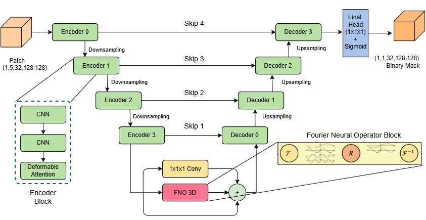
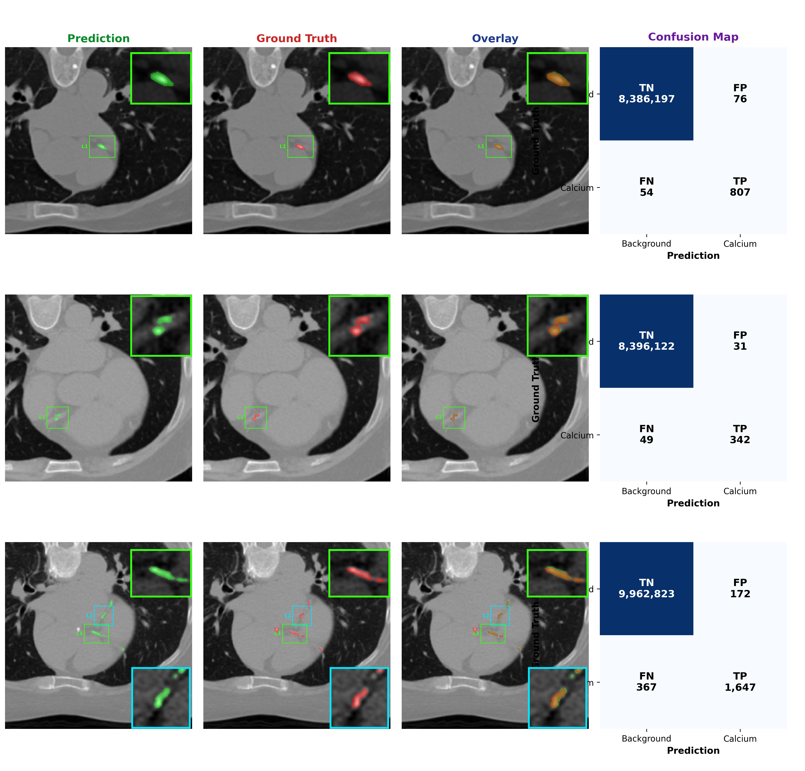
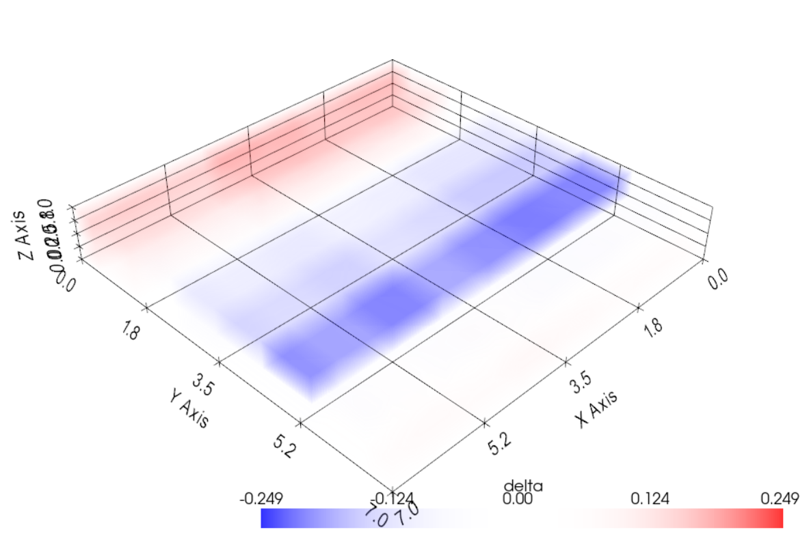
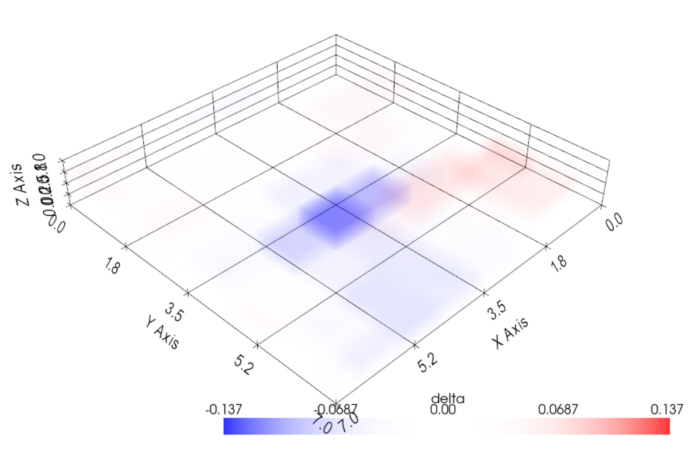
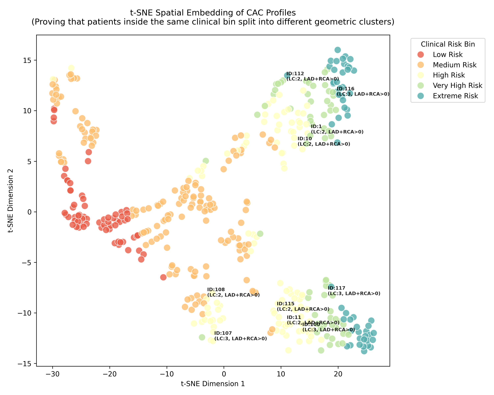

# ReRo-Net: Learning Resampling Robust Coronary Artery Calcium (CAC) Segmentation with Spectral Operator Networks

ReRo-Net is an end-to-end deep learning framework designed for the precise segmentation of Coronary Artery Calcium (CAC) lesions from cardiac CT scans. By utilizing Spectral Operator Networks, the model ensures high robustness and invariance to image resampling artifacts, providing stable and clinically relevant results.

## 🏗️ Architecture



## 🚀 Quick Start Guide

### 1. Dataset Preparation (Stanford COCA)
The project uses the public **Stanford COCA Dataset**.
- **Download**: Obtain the dataset from the [Stanford AIMI Portal](https://stanfordaimi.azurewebsites.net/datasets/e8ca74dc-8dd4-4340-815a-60b41f6cb2aa).
- **Processing**: Use the scripts in the `COCA_Scripts/` directory to prepare the data.
  - Configure your output directory in `COCA_pipeline.py`.
  - Run the pipeline to combine DICOM slices into 3D volumes, generate masks, and resample to uniform voxel spacing:
    ```bash
    python COCA_Scripts/COCA_pipeline.py
    ```
  - This produces the `data_canonical` directory required for training.

### 2. Environment Setup
All core implementation and training scripts are located in the `Segmentation/` folder.
```bash
# It is recommended to use a virtual environment
python -m venv myenv
#source venv/bin/activate  # Linux/Mac
 venv\Scripts\activate   # Windows

pip install -r Segementation/requirements.txt
```

### 3. Model Training
To train a new experiment, use the `train.py` script. The experiment name will be used to create a dedicated folder in the `runs/` directory for checkpoints and logs.
```bash
python train.py <experiment_name>
```

### 4. Evaluation & Metrics
Evaluate the model on the test split to compute voxel-wise Dice, plaque-wise F1, and Agatston scores:
```bash
python eval.py <experiment_name> --split test
```

#### Resampling Robustness
To specifically calculate evaluation metrics on resampled samples and verify the model's invariance to resolution changes, run:
```bash
python resampled_eval.py
```

## 🛠️ Advanced Features

### End-to-End Inference (`wrapper.py`)
The `wrapper.py` script provides a high-level interface for deploying the model on new, unseen NIfTI scans. It encapsulates the entire clinical pipeline:
1. **Heart ROI Detection**: Automatically generates a heart mask using a Lightweight U-Net.
2. **Preprocessing**: Applies the same transforms used during training.
3. **Inference**: Performs sliding window inference using the ReRo-Net architecture.
4. **Post-processing**: Cleans up predictions via lesion-size filtering and ROI masking.

### Qualitative Results



#### Spectral Delta Visualizations
These images illustrate the 3D spatial activation delta fields ($\delta_c$) across the bottleneck operator, highlighting the impact of coordinate encodings.

| ReRo-Net (Full) | ReRo-Net (w/o CoordConv) |
| :---: | :---: |
|  |  |
| *Absolute coordinate encodings (CoordConv) anchor representations to rigid grid planes.* | *Removing CoordConv enables the spectral bottleneck to learn relative, continuously bounded spatial features.* |


### Cluster Analysis


Visualization of clusters based on features such as RCA and LCA scores, providing insights into the distribution of calcium scores across different coronary artery segments.
To generate and visualize segmentation results, use the `EDA_EXTRA\Codes` script, which allows for the inspection of qualitative performance across different patients.

## 📦 Reproduction & Results
All pre-trained models, configuration snapshots, and evaluation logs are stored in the `runs/` folder. You can reproduce the reported results by loading these checkpoints through `eval.py`.

## 📖 Documentation
For a deep dive into specific components, please refer to the detailed `README.md` files located in each sub-directory:
- `COCA_Scripts/README.md` — Dataset processing and resampling details.
- `Segmentation/README.md` — Core architecture, training, and evaluation logic.
- `Agatston_Script/README.md` — Clinical scoring pipeline.
- `Utilities/README.md` — Helper scripts and dataset utilities.

---

**Note**: This repository was specially designed for anonymous submission(all explict file paths names were anonymized). Due to GitHub's storage limits, the model checkpoints are hosted on Google Drive. 
**Link**: [https://drive.google.com/drive/folders/108yqEBPiyfMImbNao9bamQDJDLDOe6I4?usp=drive_link]
